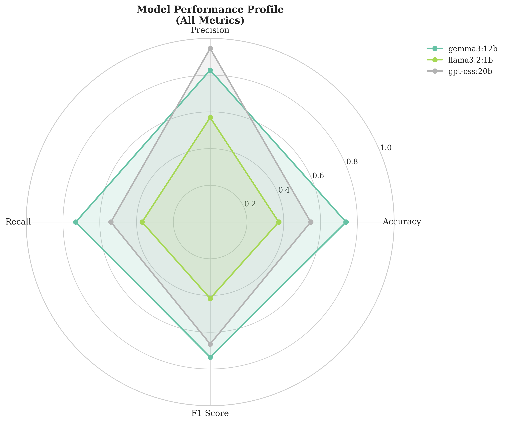
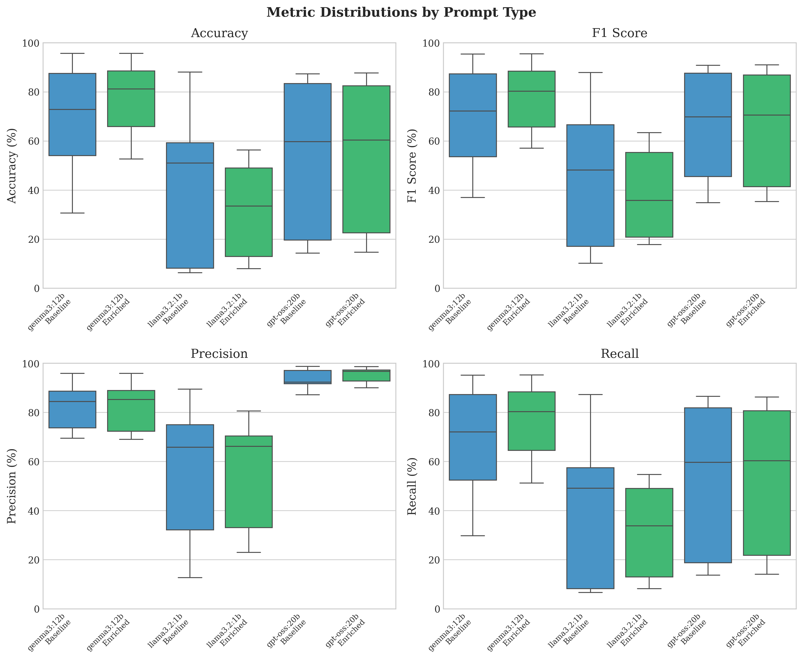
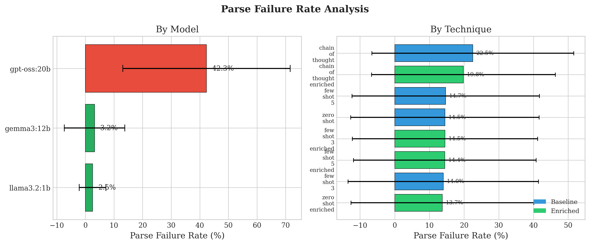

# Prompt Enrichment Evaluation: News Classification with Open Source LLMs


## Executive Summary

This project systematically evaluates whether **semantic category enrichment** improves news classification performance with open-source LLMs, replicating and extending [Yada & Yamana (2024)](https://arxiv.org/abs/2405.13007)'s work on enriched category descriptions from news recommendation to text classification. Through a controlled evaluation of 72 experimental conditions (3 models × 3 datasets × 8 prompting techniques), we establish that enrichment effectiveness is **highly technique-dependent** and cannot compensate for fundamental technique-task misalignment.

**📄 [Read the Full Technical Report](project_report/main.pdf)** | **📊 [View Experiment Results](results/run_20251204_083400_baseline_vs_enriched_v2/)**

### Key Findings

1. **Baseline Few-Shot Dominates**: Label-only Few-Shot techniques achieve the highest performance (68.2% mean F1), outperforming all enriched variants. When labeled examples exist, semantic enrichment introduces redundancy rather than clarity.

2. **Gemma3:12b is Production-Ready**: The 12B-parameter Gemma model achieves 73.6% mean F1 with balanced precision-recall and <5% parse failures, demonstrating that instruction-tuning quality matters more than raw parameter count.

3. **Chain-of-Thought Underperforms**: Despite substantial enrichment gains (+29.5 F1 points), enriched CoT (66.4% F1) still underperforms baseline Few-Shot by 16.4 points. Explicit reasoning steps fundamentally misalign with the pattern-recognition nature of classification tasks.

4. **Parameter Count ≠ Reliability**: The 20B-parameter GPT-OSS model exhibits catastrophic parse failures (80%+ on complex datasets) despite its size advantage, while the smaller 12B Gemma maintains robust output formatting across all conditions.

This work establishes a systematic framework for prompt engineering evaluation, treating prompting strategies as controlled experimental variables rather than trial-and-error optimization.

---

## Experimental Framework & Orchestration

### Local Inference Architecture

All experiments were conducted using **Ollama** for local model inference, enabling reproducible evaluation without API rate limits or cost constraints. Three recent open-source decoder-only LLMs were evaluated:

- **Gemma3:12b** (12B parameters) - Google's instruction-tuned model
- **Llama3.2:1b** (1B parameters) - Meta's compact model
- **GPT-OSS:20b** (20B parameters) - Open-source GPT variant

### Systematic Evaluation Matrix

The experimental design implements a **72-condition evaluation matrix**:

```
3 models × 3 datasets × 8 techniques = 72 unique conditions
```

**Datasets** (varying classification difficulty):
- **AG News** (4 classes): World, Sports, Business, Sci/Tech
- **BBC News** (5 classes): business, entertainment, politics, sport, tech
- **20 Newsgroups** (20 classes): Fine-grained newsgroup topics

**Prompting Techniques** (baseline + enriched variants):
- Zero-Shot: Direct classification without examples
- Few-Shot-3: Three labeled examples per class
- Few-Shot-5: Five labeled examples per class
- Chain-of-Thought: Step-by-step reasoning instructions

### Enrichment Strategy

Traditional prompts present category labels as atomic tokens:
```
Categories: Sports, Business, Technology, World
```

**Enriched prompts** augment labels with semantic context:
```
Categories:
- Sports: athletic competitions, games, teams, players, championships, tournaments, leagues
- Business: companies, markets, economy, finance, stocks, trading, corporations, revenue
- Technology: software, hardware, internet, gadgets, innovation, digital products, startups
- World: international affairs, foreign policy, geopolitics, global conflicts, diplomacy
```

The same enriched descriptions were applied consistently across all experiments, enabling direct baseline-vs-enriched comparison.

### Controlled Methodology

To ensure rigorous evaluation:

- **300 stratified samples** per condition (proportional class representation)
- **Temperature = 0** for deterministic generation (eliminates sampling variability)
- **Fixed example sets** across all experiments within each dataset-model combination
- **Identical structural formatting** for baseline and enriched variants (only category descriptions vary)

This design isolates the effect of semantic enrichment from confounding factors, treating **prompt engineering as a systematic variable** rather than an optimization process.

---

## Results & Data Interpretation

### Performance Hierarchy: Technique Ranking

Aggregated across all models and datasets, prompting techniques exhibit clear performance stratification:

| Rank | Technique | Mean F1 | Interpretation |
|------|-----------|---------|----------------|
| **1** | Few-Shot-3 (baseline) | **68.23%** | Label-only examples provide optimal classification signal |
| **2** | Few-Shot-5 (baseline) | **68.01%** | Additional examples yield marginal improvement |
| 3 | Few-Shot-5 (enriched) | 63.32% | Enrichment introduces redundancy when examples exist |
| 4 | Zero-Shot (baseline) | 62.42% | Reasonable baseline without examples |
| 5 | Few-Shot-3 (enriched) | 61.96% | Enrichment degrades Few-Shot performance |
| 6 | Zero-Shot (enriched) | 60.95% | Modest enrichment benefit without examples |
| 7 | Chain-of-Thought (enriched) | 56.00% | Enrichment helps CoT but insufficient for task |
| **8** | Chain-of-Thought (baseline) | **43.41%** | Reasoning steps misalign with classification |

> **Key Insight**: Enrichment cannot compensate for technique-task misalignment. When labeled examples already demonstrate category boundaries, semantic descriptions add redundancy rather than clarity.

### Model Comparison: Architecture Matters More Than Scale

Performance analysis reveals that **instruction-tuning quality and architectural design outweigh raw parameter count**:

| Model | Mean F1 | Parse Failures | Precision | Recall | Verdict |
|-------|---------|----------------|-----------|--------|---------|
| **Gemma3:12b** | **73.59%** | **2.3%** | 84% (balanced) | 79% (balanced) | Production-ready: balanced metrics, robust formatting |
| GPT-OSS:20b | 66.42% | **42.3%** | **95%+** | **<20%** | Catastrophic failures: extreme precision-recall imbalance |
| Llama3.2:1b | 41.61% | 2.0% | Variable | Variable | Unstable: severe enrichment sensitivity |



**Figure 1**: Model performance profiles across accuracy, precision, recall, and F1 score. Gemma3:12b exhibits balanced diamond-shaped metrics, while GPT-OSS:20b shows precision-skewed triangular profile indicating conservative prediction strategy. Llama3.2:1b demonstrates high variability across conditions.

> **Key Insight**: The 20B-parameter GPT-OSS model achieves 95%+ precision but <20% recall, producing a conservative prediction strategy where most instances remain effectively unclassified. Combined with 42% parse failures, parameter scale provides no deployment advantage over the well-tuned 12B Gemma model.

### Deep Dive: Chain-of-Thought Behavior

Chain-of-Thought prompting exhibits severe **precision-recall imbalance** that enrichment only partially addresses:

#### Baseline CoT Performance (Gemma3:12b)
| Dataset | Precision | Recall | F1 | Imbalance |
|---------|-----------|--------|-----|-----------|
| AG News | 82.9% | 45.3% | 36.9 | 37.6 points |
| BBC News | 74.7% | 48.8% | 46.6 | 25.9 points |
| 20 Newsgroups | 69.5% | 29.8% | 38.1 | 39.7 points |

The model correctly classifies instances it processes but adopts **overly conservative category assignment**, failing to confidently classify many articles.

#### Enrichment Effect on CoT
Semantic descriptions provide "anchors" for structured reasoning, substantially improving recall:

| Dataset | Δ Precision | Δ Recall | Δ F1 | Interpretation |
|---------|-------------|----------|------|----------------|
| AG News | -2.1 | **+21.7** | **+29.5** | Enrichment reduces conservative behavior |
| BBC News | +9.6 | **+27.4** | **+29.7** | Semantic context enables confident assignment |
| 20 Newsgroups | +1.5 | **+21.4** | **+18.9** | Descriptions disambiguate complex categories |

**However**, even enriched CoT substantially underperforms baseline Few-Shot:
- AG News: Enriched CoT (66.4 F1) vs Few-Shot-3 baseline (83.4 F1) = **17.0 point gap**
- BBC News: Enriched CoT (76.3 F1) vs Few-Shot-3 baseline (93.7 F1) = **17.4 point gap**



**Figure 2**: Metric distributions across prompting techniques for Gemma3:12b. Few-Shot methods maintain tight, high-performance distributions (F1 std dev: 5 points), while Chain-of-Thought exhibits high variance (F1 std dev: 15.2 points), particularly in recall. Box plots demonstrate that explicit reasoning steps fundamentally misalign with pattern-recognition classification tasks.

> **Key Insight**: Enrichment provides semantic anchors that help CoT reasoning, but cannot overcome fundamental technique-task misalignment. Classification is a pattern-recognition task where labeled examples outperform explicit reasoning by wide margins.

### Dataset Complexity Effects

Enrichment effectiveness varies with dataset characteristics:

#### BBC News (5 classes) - Ceiling Effects
- Few-Shot-3 baseline: **93.7% F1** (94.0% precision, 93.6% recall)
- Few-Shot-3 enriched: **94.8% F1** (+1.1 points)
- **Interpretation**: Well-separated categories approach performance ceiling; enrichment provides minimal benefit when category boundaries are already clear from examples.

#### 20 Newsgroups (20 classes) - Maximum Complexity
- Few-Shot-3 baseline: 61.4% F1 (72.8% precision, 60.4% recall)
- Few-Shot-3 enriched: **65.8% F1** (+4.4 points)
- **Interpretation**: Fine-grained categories benefit from semantic descriptions that disambiguate related groups (e.g., five `comp.*` categories, four `talk.*` categories). Enrichment provides explicit differentiating features.

#### Parse Failures Scale with Complexity



**Figure 3**: Parse failure rates by model and dataset. GPT-OSS exhibits catastrophically scaling failures with dataset complexity, exceeding 80% on 20 Newsgroups despite its 20B parameters. Gemma3:12b and Llama3.2:1b maintain stable rates below 5% across all datasets, demonstrating superior instruction-following.

| Dataset | Classes | Parse Failures | Best Technique F1 |
|---------|---------|----------------|-------------------|
| BBC News | 5 | 4.2% | 95.4% (Few-Shot-5) |
| AG News | 4 | 12.0% | 86.3% (Few-Shot-5 enriched) |
| 20 Newsgroups | 20 | **31.8%** | 65.8% (Few-Shot-3 enriched) |

Parse failures represent **production deployment risk**: 31.8% failure rate means nearly 1-in-3 predictions are unparseable and unusable.

---

## Engineering Insights: Lessons Learned

### For Practitioners Building LLM Classification Systems

#### 1. Technique Selection Matters Most
**Few-Shot with label-only prompts** achieves the best balance of performance, stability, and simplicity. No need for semantic enrichment engineering when you have labeled examples—the examples themselves demonstrate category boundaries more effectively than descriptions.

**Recommendation**: Start with Few-Shot-3. Only consider enrichment if:
- You're stuck with zero-shot constraints (no training data)
- Dataset has 15+ fine-grained categories with semantic overlap
- Baseline Few-Shot parse failures exceed 10%

#### 2. Model Selection Criteria

Prioritize these factors over raw parameter count:

**Critical metrics**:
- ✅ **Balanced precision-recall** (within 5 points)
- ✅ **Parse failure rate** (target <5% on representative complexity)
- ✅ **Instruction-following** under output format constraints

**Secondary metrics**:
- Accuracy/F1 scores
- Inference latency
- Memory footprint

**Case study**: Gemma3:12b (12B params, 2.3% failures, 73.6% F1) outperforms GPT-OSS:20b (20B params, 42.3% failures, 66.4% F1) for production deployment despite smaller size.

#### 3. Chain-of-Thought is Not Universal

CoT substantially improves **arithmetic and symbolic reasoning** tasks (Wei et al. 2022) but **misaligns with perceptual pattern-recognition** tasks like classification.

**When to use CoT**:
- Multi-step mathematical problems
- Logical deduction chains
- Complex reasoning requiring intermediate steps

**When NOT to use CoT**:
- Classification (pattern matching)
- Named entity recognition
- Sentiment analysis
- Any task where examples > reasoning

#### 4. Parse Failures = Production Risk

Average 16% parse failure rate across all experiments means **1-in-6 predictions are unusable** in production. This metric is often ignored in benchmarks but critically impacts real-world deployment.

**Monitor parse failures during evaluation**:
- Log raw model outputs for manual inspection
- Test with representative input complexity (not just clean benchmark data)
- Implement fallback strategies (retry with constrained prompt, rule-based classifier)

#### 5. Enrichment ROI is Low for Most Use Cases

When labeled examples exist, enrichment:
- ❌ Introduces redundancy (Few-Shot-3 baseline: 68.2% F1 → enriched: 62.0% F1)
- ❌ Increases prompt length and inference cost
- ❌ Requires manual curation of semantic descriptions
- ✅ Only helps zero-shot (+1.5% F1) and complex multi-class scenarios (+4.4% F1 on 20NG)

**Save engineering effort**: Use baseline Few-Shot unless you have specific evidence enrichment helps your task.

### Framework for Systematic Prompt Engineering

This evaluation establishes a methodology for rigorous prompt engineering research:

1. **Decompose prompting into orthogonal variables**:
   - Examples: zero-shot vs few-shot (3 vs 5)
   - Reasoning: direct vs chain-of-thought
   - Enrichment: label-only vs semantic descriptions

2. **Measure reliability alongside performance**:
   - Standard metrics: accuracy, precision, recall, F1
   - **Critical addition**: parse failure rate

3. **Use controlled experimental design**:
   - Fix all variables except one (e.g., enrichment: on/off)
   - Consistent sampling (stratified, fixed seeds)
   - Temperature = 0 for deterministic outputs

4. **Visualize trade-offs**:
   - Radar charts for precision-recall-F1 balance
   - Box plots for technique variance
   - Failure rate bar charts by model/dataset

This systematic approach enables **reproducible prompt engineering** rather than anecdotal "vibes-based" optimization.

---

## Reproducibility

### Quick Start (5 minutes)

```bash
# Prerequisites: Python 3.8+, uv, Ollama
curl -LsSf https://astral.sh/uv/install.sh | sh
ollama pull gemma3:12b

# Setup
cd news_classification_prompts
./setup.sh

# Verify installation
uv run python check_status.py

# Run quick test (10 samples)
uv run python experiments.py \
  --models gemma3:12b \
  --datasets ag_news \
  --techniques few_shot_3,few_shot_3_enriched \
  --limit 10 \
  --run-name quick_test
```

### Reproduce Baseline vs Enriched Comparison

```bash
# Full evaluation matrix (72 conditions, ~2-3 hours on M1 Mac)
uv run python experiments.py \
  --models gemma3:12b,llama3.2:1b,gpt-oss:20b \
  --datasets ag_news,bbc_news,20newsgroups \
  --techniques zero_shot,zero_shot_enriched,few_shot_3,few_shot_3_enriched,few_shot_5,few_shot_5_enriched,chain_of_thought,chain_of_thought_enriched \
  --limit 300 \
  --run-name baseline_vs_enriched_reproduction
```

Results will be saved to `results/run_YYYYMMDD_HHMMSS_baseline_vs_enriched_reproduction/` with:
- `summary.csv` - One row per condition with all metrics
- `figures/` - 15+ visualization plots (radar charts, heatmaps, distributions)
- `tables/` - Comparative analysis tables (technique ranking, model comparison)
- `statistical_summary.txt` - Statistical analysis and key findings

### Key Project Files

- **Experiment Pipeline**: [experiments.py](experiments.py) (582 lines) - Orchestrates matrix sweeps, manages result logging
- **Prompt Templates**: [prompts/](prompts/) - Editable text templates for all techniques (zero-shot, few-shot, CoT, enriched variants)
- **Datasets**: [data/](data/) - Auto-downloaded and preprocessed (AG News, BBC News, 20 Newsgroups)
- **Reference Results**: [results/run_20251204_083400_baseline_vs_enriched_v2/](results/run_20251204_083400_baseline_vs_enriched_v2/) - Complete experimental run with all figures and tables
- **Technical Report**: [project_report/main.pdf](project_report/main.pdf) - Full research paper with methodology and statistical analysis

For detailed architecture, module documentation, and troubleshooting, see [ARCHITECTURE.md](ARCHITECTURE.md).

---

## Technical Deep Dive

For comprehensive methodology, statistical analysis, and per-class performance breakdowns:

- **Research Report**: [project_report/main.pdf](project_report/main.pdf) - Complete analysis with figures, tables, and statistical tests (LaTeX source: [main.tex](project_report/main.tex))
- **Result Figures**: [project_report/](project_report/) - Model radar charts (fig2), parse failure analysis (fig3), metric distributions (fig8)
- **Detailed Results**: [results/run_20251204_083400_baseline_vs_enriched_v2/](results/run_20251204_083400_baseline_vs_enriched_v2/) - Raw experimental data, comparative tables, visualization suite
- **Statistical Summary**: [results/run_20251204_083400_baseline_vs_enriched_v2/statistical_summary.txt](results/run_20251204_083400_baseline_vs_enriched_v2/statistical_summary.txt) - Correlation analysis, metric distributions, best/worst configurations

### Experimental Design Details

**Sample Selection**: 300 stratified samples per condition maintain proportional class representation. Sampling was performed once and fixed across all technique variants within each dataset-model combination to ensure observed differences stem from prompting strategy rather than sample composition.

**Temperature Setting**: Temperature = 0 ensures deterministic generation, eliminating sampling variability and enabling reliable baseline-vs-enriched comparison.

**Prompt Structure**: All prompts share identical formatting, varying only in category descriptions (label-only vs semantic enrichment). Few-Shot prompts maintain consistent example ordering and formatting across baseline/enriched variants.

**Evaluation Metrics**: Standard classification metrics (accuracy, precision, recall, F1) computed via scikit-learn with macro-averaging. Parse failures recorded separately when model outputs don't conform to single-category format.

---

## Research Context

This work replicates and extends:

> Yuki Yada and Hayato Yamana. 2024. "News Recommendation with Category Description by a Large Language Model." *arXiv preprint arXiv:2405.13007*.

**Original contribution**: Yada & Yamana demonstrated that LLM-generated category descriptions improved news recommendation AUC by up to 5.8% compared to label-only approaches in encoder-based architectures.

**This work**: Evaluates semantic enrichment for **decoder-only LLMs** in **zero-shot and few-shot classification** settings, establishing that enrichment effectiveness is highly technique-dependent and cannot substitute for demonstration-based learning from labeled examples.
